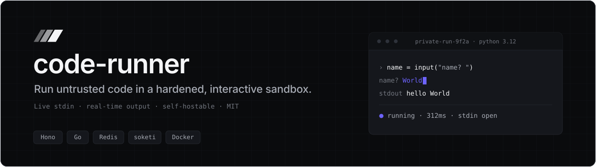
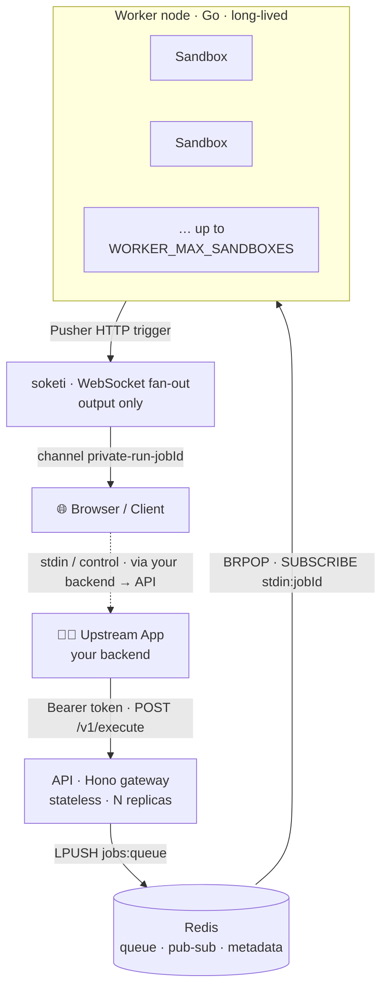
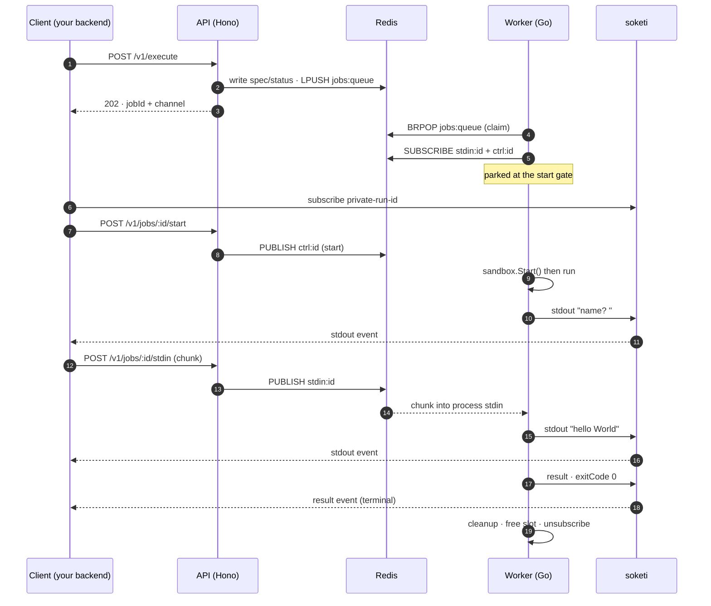

<!-- banner -->
<p align="center">
  
</p>

<p align="center">
  <a href="LICENSE"></a>
  <a href="https://github.com/teovillanueva/code-runner/actions/workflows/ci.yml"></a>
  <a href="https://github.com/teovillanueva/code-runner/actions/workflows/abuse.yml"></a>
  <a href="https://www.npmjs.com/package/@teovilla/code-runner-sdk-node"></a>
  
  
</p>

<p align="center">
  <b>An open-source, self-hostable remote code execution service with live interactive stdin.</b><br/>
  Run untrusted code in a hardened sandbox and stream output in real time over soketi (Pusher-compatible).
</p>

<p align="center">
  <a href="#-quickstart">Quickstart</a> ·
  <a href="#-architecture">Architecture</a> ·
  <a href="#-api-reference">API</a> ·
  <a href="#-client-sdks">SDKs</a> ·
  <a href="#-adding-a-language">Add a language</a> ·
  <a href="#-deployment">Deploy</a>
</p>

---

## ✨ What it is

**code-runner** is a [Piston](https://github.com/engineering-online/piston)-style remote
execution service, built as a polyglot monorepo, that does one thing well: take some
code, run it in an isolated **hardened sandbox** with a **live interactive stdin
session**, and stream the output back in real time — without ever leaking a container,
a subscription, or a session slot.

It is an **internal service**: never exposed to the internet directly. In front of it
sits *your own backend* (any stack), which authenticates with a bearer token. Browsers
only ever *receive* output — over soketi — and never send trusted input directly.

| | |
| --- | --- |
| 🛡️ **Hardened by default** | `network=none`, read-only rootfs, dropped capabilities, deny-by-default seccomp, non-root user, cgroup memory/CPU/PID limits — on **every** sandbox, unconditionally. gVisor is a one-env-var swap. |
| ⌨️ **Live interactive stdin** | Write to a running process mid-execution and watch stdout/stderr stream back chunk by chunk over WebSockets. |
| ⏱️ **Three independent clocks** | Wall, idle, and CPU time bound every sandbox. Any clock firing kills it unconditionally — no leaks, ever. |
| 🧩 **Polyglot by design** | A Hono/TypeScript gateway, a Go worker, and a JSON-Schema wire contract that generates TS types + Zod validators + Go structs from one source. |
| 📦 **Add a language = a folder** | Each language is a `manifest.json` + `Dockerfile`, auto-discovered at boot. Zero changes to Go or the API. |
| ☁️ **Stateless & scalable** | Autoscale the worker fleet by Redis queue depth. Scale-to-zero friendly. MIT, self-hostable, BYO OpenTelemetry. |

> [!TIP]
> There is a full documentation site under [`apps/docs`](apps/docs) (Next.js + Fumadocs).
> Run it locally with `pnpm --filter docs dev` and open http://localhost:3000.

---

## 🏗️ Architecture

All trusted input (code, stdin, control) enters through **one** bearer-authed door — the
API. soketi is **output-only** toward the client; nothing trusted ever enters through it.



**The components**

- **`apps/api` — Hono / TypeScript.** The single trusted entry point. Validates requests
  (constant-time bearer auth), resolves the language manifest, writes the job to Redis,
  and relays stdin & control signals. Stateless → runs anywhere, scales to N replicas.
- **`apps/worker` — Go.** Claims jobs from Redis, launches hardened sandboxes via the
  host Docker daemon (behind a swappable `Runner` interface), enforces the three clocks,
  pumps stdin in and streams output out. The **unit of scale**.
- **Density tier (optional).** A `ZygoteRunner` can run heavy interpreted languages (Python) on a warm copy-on-write pool for ~2.7× concurrency on Fly — off by default, falls back to per-job containers. See [`docs/zygote.md`](docs/zygote.md).
- **`packages/contract` — JSON Schema → TS + Zod + Go.** The shared wire contract. One
  schema generates types for every language; a CI drift check guards the seam.
- **Redis** — job queue (`jobs:queue`), stdin/control pub-sub (`stdin:<id>`, `ctrl:<id>`),
  and job metadata (`job:<id>:{spec,status,output}`).
- **soketi** — Pusher-compatible WebSocket fan-out. The worker *triggers*; soketi
  *delivers* to subscribers.

> [!IMPORTANT]
> The **worker requires native TCP Redis** (`redis://`/`rediss://`) — it uses blocking
> `BRPOP` and `SUBSCRIBE`. Serverless REST-only Redis (e.g. Upstash's REST tier) works
> for the API but **not** the worker. See [`docs/redis-constraint.md`](docs/redis-constraint.md).

---

## 🚀 Quickstart

### Prerequisites

- **Docker Desktop** running (cgroup v2 required for resource limits)
- **Node.js 22+** and **pnpm 10+** · **Go 1.26+**
- Ports `8080` (API) and `6001` (soketi) free

### Five steps to a working interactive run

```bash
# 1. Copy env (all defaults are safe for local dev)
cp .env.example .env

# 2. Build the language sandbox images on the host daemon (no Docker-in-Docker)
make build-images       # executor/python:3.12  rust:1.83  r:4.4  sqlite:3

# 3. Bring up the stack: redis + soketi + api + worker
docker compose up       # or: make up

# 4. Run the interactive end-to-end demo
make e2e

# 5. Tear down
make down
```

`make e2e` drives an interactive Python program that prompts for a name, sends `World`
over stdin, and asserts the round-trip:

```text
[stub] stdout: name?
[stub] detected prompt, sending stdin: World
[stub] stdout: hello World
[stub] result: exitCode=0 reason=exit durationMs=...
[PASS] ===== E2E PASS: interactive execute hello World round-trip succeeded =====
```

Health check (no auth): `curl http://localhost:8080/health` → `{"status":"ok"}`.

---

## 🔄 Interactive flow

The **start-handshake** is the crux: the worker parks the job until you signal `start`,
so your client is guaranteed to be subscribed before any output is emitted (soketi
pub-sub drops events that have no live subscriber).



### The three clocks

Each sandbox is bounded by three independent clocks; **any one firing kills it**:

| Clock | Limit | Fires when… | Result field |
| --- | --- | --- | --- |
| **Wall** | `wallTimeMs` | total lifetime exceeds the limit | `timedOut` |
| **Idle** | `idleMs` | no output **and** no stdin for the window (resets on activity) | `idleTimedOut` |
| **CPU** | `cpuMs` | cumulative cgroup CPU time exceeds the limit | `timedOut` |

Plus `memoryMb` (OOM kill, swap disabled), `pids` (fork-bomb guard), and `outputKb`
(combined stdout+stderr budget; overflow → `truncated`).

---

## 📡 API Reference

All `/v1/*` endpoints require `Authorization: Bearer <EXECUTOR_API_TOKEN>`. A missing or
invalid token → `401 {"error":"unauthorized"}` (constant-time comparison). `GET /health`
is the only unauthenticated route.

| Method | Path | Purpose |
| --- | --- | --- |
| `GET` | `/health` | Readiness probe (no auth). |
| `POST` | `/v1/execute` | Submit code → `202 {jobId, channel, status}`. |
| `POST` | `/v1/jobs/:id/start` | The start-handshake signal. |
| `POST` | `/v1/jobs/:id/stdin` | Write a chunk to the process stdin. |
| `POST` | `/v1/jobs/:id/stdin/close` | Signal EOF (Ctrl-D). |
| `POST` | `/v1/jobs/:id/kill` | SIGKILL the sandbox. |
| `GET` | `/v1/jobs/:id` | Poll job status. |
| `GET` | `/v1/jobs/:id/output` | Pull persisted output (needs `collectOutput`). |
| `GET` | `/v1/languages` | List discovered languages. |
| `POST` | `/v1/channel-auth` | Optional soketi channel-auth helper (`ENABLE_CHANNEL_AUTH=true`). |

<details>
<summary><b>POST /v1/execute</b> — request & responses</summary>

```jsonc
// Request body
{
  "language": "python",            // name or alias: "py", "rust", "rs", "sqlite", "sql", …
  "version": "3.12",               // optional; omit to use the only/most-recent match
  "files": [
    { "name": "main.py", "content": "name = input('name? ')\nprint(f'hello {name}')\n" }
  ],
  "limits": {                      // optional per-request overrides; absent → manifest defaults
    "wallTimeMs": 30000, "idleMs": 10000, "cpuMs": 15000,
    "memoryMb": 128, "pids": 64, "outputKb": 512
  },
  "collectOutput": false           // true → persist a pullable RunResult
}
```

| Code | Body | When |
| --- | --- | --- |
| `202` | `{"jobId","channel":"private-run-<jobId>","status":"queued"}` | Accepted; enqueued. |
| `400` | `{"error","details":[…]}` | Invalid body / unknown language or version. |
| `429` | `{"error":"Executor at capacity…","retryAfterMs":1000}` | `LLEN(jobs:queue) >= MAX_QUEUE_DEPTH`. |

</details>

<details>
<summary><b>Job status, output & languages</b> — response shapes</summary>

**`GET /v1/jobs/:id`** → `200 JobStatus` / `404`:

```json
{ "jobId":"<uuid>", "channel":"private-run-<uuid>", "language":"python",
  "version":"3.12", "state":"running", "updatedAtMs":1700000000000 }
```

`state` ∈ `queued` · `starting` · `running` · `done` · `killed` · `error`.

**`GET /v1/jobs/:id/output`** → `200 RunResult` / `404` (single 404 for all absence — callers can't probe which ids exist):

```json
{ "exitCode":0, "signal":null, "timedOut":false, "idleTimedOut":false,
  "truncated":false, "durationMs":312, "stdout":"hello World\n", "stderr":"",
  "artifacts":[{ "name":"plot.png", "mimeType":"image/png", "bytes":20481, "url":"https://…" }],
  "artifactsTruncated":false }
```

**`GET /v1/languages`** → `200`:

```json
[ { "language":"python", "version":"3.12", "aliases":["py","py3","python3"], "interactive":true } ]
```

</details>

<details>
<summary><b>Output events</b> — emitted on <code>private-run-&lt;jobId&gt;</code></summary>

soketi delivers each event's data as a **JSON-encoded string** — parse with `JSON.parse`.

- **`stage`** — `{ "phase": "queued" | "compiling" | "running" }`
- **`stdout` / `stderr`** — `{ "chunk": "name? ", "seq": 0 }` (reassemble by `seq`)
- **`result`** (terminal, once) — `{ exitCode, signal, timedOut, idleTimedOut, truncated, durationMs }`
- **`artifact`** — `{ name, mimeType, bytes, url }` (presigned GET URL, no bearer)

</details>

---

## 📚 Client SDKs

Three published packages cover both sides of the trust boundary:

| Package | Side | Role |
| --- | --- | --- |
| [`@teovilla/code-runner-sdk-node`](packages/code-runner-sdk-node) | **server** | Typed `CodeRunnerClient` over the gateway + soketi channel-auth signing. |
| [`@teovilla/code-runner-react`](packages/code-runner-react) | **browser** | `CodeRunnerProvider` + `useCodeRunnerJob` hook for live output. Token-free. |
| [`@teovilla/code-runner-contract`](packages/contract) | shared | The generated wire contract (types, Zod, channel/event helpers). |

**Backend (submit + drive):**

```ts
import { CodeRunnerClient } from "@teovilla/code-runner-sdk-node";

const client = new CodeRunnerClient({ baseUrl: "http://localhost:8080", token: process.env.EXECUTOR_API_TOKEN! });
const job = await client.execute({ language: "python", files: [{ name: "main.py", content: "print(input())" }] });
// subscribe on the browser, then:
await client.start(job.jobId);
await client.sendStdin(job.jobId, "world\n");
```

**Browser (subscribe to live output):**

```tsx
const { stage, stdout, stderr, result, sendStdin } = useCodeRunnerJob({
  jobId,
  onStdin: (chunk) => fetch(`/api/jobs/${jobId}/stdin`, { method: "POST", body: JSON.stringify({ chunk }) }),
});
```

The bearer token and soketi `APP_SECRET` never leave the server — the browser receives
output only and routes actions back through your backend. See each package's README for
the full API.

---

## 🧩 Adding a language

Languages are self-contained packages in `languages/<lang>-<version>/`. Adding one needs
**zero** changes to the worker or the API — only a folder, a `manifest.json`, and a
`Dockerfile`. A language is defined entirely by `image + compile? + run`.

```jsonc
// languages/rust-1.83/manifest.json  (a compiled language)
{
  "language": "rust", "version": "1.83", "aliases": ["rs"],
  "image": "executor/rust:1.83", "entrypoint": "main.rs",
  "compile": ["rustc", "-O", "main.rs", "-o", "/workspace/prog"],   // null for interpreted langs
  "run": ["/workspace/prog"],
  "interactive": true,
  "defaultLimits": { "wallTimeMs": 120000, "idleMs": 15000, "cpuMs": 60000, "memoryMb": 512, "pids": 128, "outputKb": 1024 }
}
```

```bash
make rust-image          # build executor/rust:1.83 on the host daemon (or: make build-images)
docker compose up --build  # the manifest loader auto-discovers the new folder at boot
curl localhost:8080/v1/languages -H "Authorization: Bearer $EXECUTOR_API_TOKEN"  # verify
```

Bundled languages: **Python 3.12**, **Rust 1.83**, **R 4.4**, **SQLite 3** — the last two
prove the abstraction holds for a non-interactive language and a non-general-purpose tool.

> [!WARNING]
> Before a new language merges, its image must survive the **abuse suite** — see
> [Safety gate](#-safety-gate).

---

## ☁️ Deployment

**Scaling unit: the worker node.** A long-lived Go process that claims jobs and launches
sandboxes internally (up to `WORKER_MAX_SANDBOXES`). Autoscale the fleet by
`LLEN jobs:queue`.

- **Fly.io** — [`fly-autoscaler`](https://github.com/superfly/fly-autoscaler) on the Redis
  `llen` metric; a four-app reference deploy lives in [`deploy/fly`](deploy/fly) and is
  documented in [`docs/deploy-fly.md`](docs/deploy-fly.md).
- **Kubernetes** — KEDA's Redis scaler on `LLEN jobs:queue`, or an HPA custom metric.
- **Extra isolation** — set `SANDBOX_RUNTIME=runsc` to run under [gVisor](https://gvisor.dev)
  with no code changes; the Sentry intercepts all syscalls.

The **API** is stateless (runs anywhere, serverless OK). **soketi** runs as a sidecar or
standalone. See [`docs/scaling.md`](docs/scaling.md) for the full topology and
scale-to-zero caveats.

<details>
<summary><b>Environment variables</b> — the full table</summary>

| Variable | Default | Description |
| --- | --- | --- |
| `EXECUTOR_API_TOKEN` | `dev-insecure-token-change-me` | Bearer token. **Change in prod** (`openssl rand -hex 32`). |
| `REDIS_URL` | `redis://redis:6379` | Native TCP Redis. |
| `API_PORT` | `8080` | API listen port. |
| `MAX_QUEUE_DEPTH` | `256` | `/v1/execute` → `429` when `LLEN(jobs:queue) >=` this. |
| `SOKETI_HOST` / `SOKETI_PORT` | `soketi` / `6001` | soketi address. |
| `SOKETI_USE_TLS` | `false` | Connect to soketi over TLS. |
| `SOKETI_APP_ID` / `_APP_KEY` | `code-runner` / `code-runner-key` | Pusher app id & **public** key. |
| `SOKETI_APP_SECRET` | `code-runner-secret` | **Never returned by any endpoint, never written to Redis. Change in prod.** |
| `WORKER_MAX_SANDBOXES` | `8` | Max concurrent sandboxes per worker node. |
| `DOCKER_HOST` | `unix:///var/run/docker.sock` | Docker endpoint. No Docker-in-Docker. |
| `SANDBOX_RUNTIME` | _(unset = runc)_ | `runsc` to enable gVisor. |
| `WORKER_WARMUP_MS` | `30000` | Slot reclaim timeout if `/start` never arrives. |
| `WORKER_HEARTBEAT_INTERVAL_MS` / `_TTL_MS` | `5000` / `20000` | Worker liveness heartbeat. |
| `BUCKET_NAME` + `AWS_*` | _(unset = artifacts off)_ | S3-compatible artifact storage (MinIO/Tigris/S3/R2). |
| `RUN_RESULT_TTL` / `PRESIGNED_URL_TTL` / `ARTIFACT_S3_OBJECT_TTL` | `600s` / `24h` / `3d` | Retention TTLs (object TTL must be ≥ presigned). |
| `OTEL_EXPORTER_OTLP_ENDPOINT` | _(unset = off)_ | **The telemetry ON switch.** Point at an OTLP collector. |
| `OTEL_TRACES_SAMPLER_ARG` | `1.0` | Sampling ratio. **Lower in prod** (e.g. `0.05`). |

The full list (including all `OTEL_*` and stub variables) is in [`.env.example`](.env.example).

</details>

### 🔭 Observability (bring-your-own OpenTelemetry)

Both API and worker are fully OpenTelemetry-instrumented but ship **telemetry-off by
default** — zero overhead until you set `OTEL_EXPORTER_OTLP_ENDPOINT`. When enabled, one
execution produces **a single connected trace** spanning the API and the worker
(`claim → sandbox.create → handshake.wait → compile → run → publish.result`). An example
collector + Jaeger ships **inert** under the `observability` compose profile:

```bash
docker compose --profile observability up --build
bash scripts/observability-e2e.sh    # → Jaeger UI: http://localhost:16686
```

---

## 🔒 Safety gate

The adversarial **abuse suite** (`internal/worker/abuse_test.go`, build tag `abuse`) is the
required gate before any language is added. It drives 7 hostile jobs through the full
worker path on **real Linux cgroup v2** — OOM kills, CPU throttling, wall-time expiry,
idle timeout, PID exhaustion, output truncation, and clean-exit containment.

```bash
make python-image
docker run -d -p 6381:6379 redis:7
make abuse
```

CI ([`.github/workflows/abuse.yml`](.github/workflows/abuse.yml)) runs it on every PR on
`ubuntu-latest`. Repo owners should make **"abuse / abuse"** a required status check on
`main` so fan-out PRs can't merge unless it's green.

---

## 🛠️ Make targets

| Target | Description |
| --- | --- |
| `build-images` | Build all language sandbox images on the host daemon. |
| `up` / `down` | Bring the local stack up (`--build`) / tear down (`-v`). |
| `e2e` | Interactive end-to-end demo. |
| `artifacts-e2e` | Artifacts pull-loop end-to-end. |
| `abuse` | Adversarial safety suite (Docker cgroup v2 + redis:7 on `:6381`). |
| `test` | All unit/integration tests (Go + JS). |
| `contract` / `contract-check` | Regenerate the wire contract / fail on drift. |

---

## 📂 Repository layout

```text
apps/
  api/        Hono/TypeScript gateway          packages/
  worker/     Go worker + sandbox runner         contract/              wire contract (schema → TS+Zod+Go)
  stub/       interactive E2E driver             code-runner-sdk-node/  server SDK
  docs/       Fumadocs documentation site        code-runner-react/     browser SDK
internal/     Go packages (runner, session,    languages/    one folder per language (manifest + Dockerfile)
              jobstore, publisher, reaper, …)  profiles/     seccomp profile
deploy/fly/   Fly.io reference deploy          observability/ OTel collector config
```

---

## 🤝 Contributing

Contributions are welcome. The one hard rule before merging a new language or a worker
change: **the abuse suite must be green.** See [Safety gate](#-safety-gate). Run
`make test` and `make contract-check` before opening a PR.

## 📄 License

[MIT](LICENSE) — self-hostable, no strings attached.
