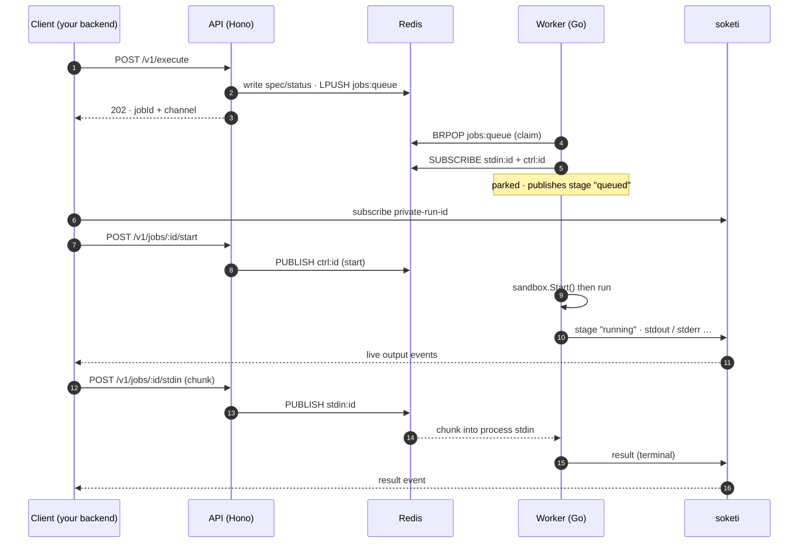
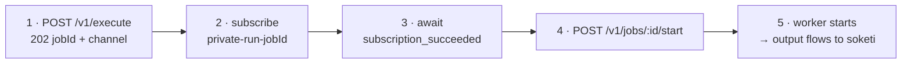

A single execution moves through a precise sequence of steps across the API, Redis,
the worker, and soketi. Understanding the order — especially the **start-handshake**
— is the key to integrating correctly.

## The full sequence



## The start-handshake

soketi pub-sub is **fire-and-forget**: if no client is subscribed when an event is
published, that event is simply lost. If the worker started executing the instant
the job was claimed, the first lines of output could be emitted *before* the client
finished subscribing — and vanish.

The **start-handshake** closes that race:

<Callout type="info">
  The worker subscribes to the job's channels and then **parks** the job, doing
  nothing until it receives an explicit `start` signal. Your client subscribes to
  the soketi channel *first*, confirms the subscription, and only then calls
  `POST /v1/jobs/:id/start`. By the time output begins, a subscriber is guaranteed
  to be listening.
</Callout>



This applies to **batch jobs too** (no stdin expected) — follow the same sequence.
If `/start` never arrives, the worker reclaims the slot after `WORKER_WARMUP_MS`
(default 30s) so a never-started job can't hold capacity forever.

<Callout type="info">
  With the [React SDK](/docs/guides/react-sdk), `useCodeRunnerJob` exposes an
  `onSubscribed` callback that fires exactly on `subscription_succeeded` — wire
  your `start` call there and the handshake is handled for you.
</Callout>

## Stages and the terminal result

As a job progresses, the worker emits `stage` events on the soketi channel:

`queued` → `compiling` (compiled languages only) → `running`

During the `compiling` stage the worker streams a **live build log** on its own
`compile_output` event — the interleaved stdout+stderr of the compile command, kept
separate from the program's run `stdout`/`stderr`. If compilation fails (non-zero
exit) the run stage never starts, and the persisted `RunResult.compile` block holds
the full build output. (A clean compile emits nothing, so the build log stays empty.)

The worker then emits exactly one terminal **`result`** event when the sandbox exits.
The result tells you *why* it ended:

```json
{
  "exitCode": 0,
  "signal": null,
  "timedOut": false,
  "idleTimedOut": false,
  "truncated": false,
  "durationMs": 312
}
```

- `exitCode` is `null` when the process was killed by a signal.
- `timedOut` covers **wall-clock and CPU-clock** expiry.
- `idleTimedOut` covers **idle-clock** expiry.
- `truncated` is `true` if output exceeded the `outputKb` budget.

See the [three clocks](/docs/concepts/three-clocks) for what each timeout means, and
the [events reference](/docs/api/events) for every event payload.

## Driving stdin and control

While a job runs you can:

| Action | Endpoint | Effect |
| --- | --- | --- |
| Send input | `POST /v1/jobs/:id/stdin` | Publishes a chunk to `stdin:<id>`; the worker writes it to the process stdin. |
| Signal EOF | `POST /v1/jobs/:id/stdin/close` | Publishes `{type:"stdin_close"}`; the worker closes stdin (like Ctrl-D). |
| Kill | `POST /v1/jobs/:id/kill` | Publishes `{type:"kill"}`; the worker SIGKILLs the sandbox. |

stdin is rate-limited at the API (a frame-rate cap and a pending-byte cap) to keep a
single client from flooding the worker. Exceeding either returns `429`.

## Collecting output after the fact

Real-time output is delivered over soketi. If you also want a **pullable** copy —
useful for clients that weren't subscribed, or for batch workflows — set
`collectOutput: true` on the execute request. The worker then persists a `RunResult`
(stdout, stderr, and any artifacts) to Redis with a TTL, retrievable via
`GET /v1/jobs/:id/output`. See [Artifacts & pullable output](/docs/guides/artifacts).
