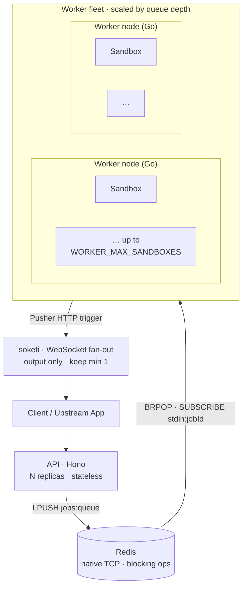

code-runner is designed to scale horizontally. Both the API and the worker are
**stateless** — all shared state lives in Redis — so you scale each tier by adding
replicas.

## The topology



## The scaling unit is the worker node

A worker is a **long-lived Go process** that claims jobs and launches sandboxes
*internally* — up to `WORKER_MAX_SANDBOXES` concurrently. The unit of scale is the
**node**, not a microVM per execution. This is what makes interactive sessions cheap:
holding a slot open for a live stdin session is just a goroutine, not a VM.

Capacity is governed by an in-memory semaphore inside each worker (authoritative), with
the Redis queue depth as the cross-fleet signal.

## Autoscale by queue depth

Scale the worker fleet on `LLEN jobs:queue`.

<Callout type="info">
  Autoscaling **relies on queueing being safe**: when a burst arrives faster than
  machines can boot, jobs wait in `jobs:queue` until a worker frees up. That works
  because the [start-handshake is durable](/docs/concepts/lifecycle#the-start-handshake)
  — a `start` sent while a job is still queued is persisted and honoured when a worker
  finally claims it, instead of being lost. Without that, every job that queued behind
  capacity would die at the warm-up timeout, which defeats the point of autoscaling.
</Callout>

**Fly.io** — use [`fly-autoscaler`](https://github.com/superfly/fly-autoscaler), a
separate app that scales your worker by a metric. It reads from **Prometheus or
Temporal** (there is no built-in Redis collector), so the queue depth must be exposed
as a scrapable Prometheus metric first. The autoscaler then runs an Expr expression
each loop:

```toml
# fly.toml for the autoscaler app (image: flyio/fly-autoscaler:0.3, --ha=false)
[env]
  FAS_APP_NAME              = "code-runner-worker"
  FAS_PROMETHEUS_ADDRESS    = "https://api.fly.io/prometheus/<org>"
  FAS_PROMETHEUS_METRIC_NAME = "inflight"
  # In-flight = running + queued. Scaling on this makes scale-down safe (the
  # target only drops when sessions END), unlike queue depth alone.
  FAS_PROMETHEUS_QUERY      = "sum(code_runner_slots_used) + max(code_runner_queue_depth)"
  # ~20 sessions per machine; clamp to a sane ceiling.
  FAS_STARTED_MACHINE_COUNT = "min(6, max(1, ceil(inflight / 20)))"
  # FAS_API_TOKEN / FAS_PROMETHEUS_TOKEN are set as secrets.
```

<Callout type="info">
  The worker exposes `code_runner_slots_used/_max` + `code_runner_queue_depth` on
  `WORKER_METRICS_PORT` (`9091`), scraped by Fly via the `[metrics]` block in the worker
  `fly.toml`. Scaling on **in-flight** (`slots_used + queue_depth`) means scale-down
  waits for sessions to finish. See the
  [Autoscaling on Fly runbook](/docs/self-hosting/autoscaling-fly).
</Callout>

**Kubernetes** — use [KEDA](https://keda.sh/) with the Redis scaler on
`LLEN jobs:queue` (KEDA *does* have a native Redis list scaler), or an HPA backed by a
custom metric from a Redis exporter.

## Scale to zero

Because the API is stateless and the worker only holds in-flight jobs, the worker
fleet can scale to zero when the queue is empty. Jobs submitted while at zero sit in
`jobs:queue` until the autoscaler spins a worker up and it `BRPOP`s them. Keep at least
one API replica (or a scale-to-zero platform with fast cold start) so new jobs can be
enqueued.

soketi should **stay up** (min 1) — it's the live output transport and clients hold
persistent WebSocket connections to it.

## Worker image cache & cold-start

A worker caches language images in its embedded dockerd's store at `/var/lib/docker`.
A fresh store is empty, so a brand-new node's first boot pays a one-time cost
populating it (pull/load the language images). How you avoid that on every new node
depends on the worker's filesystem:

- **Host-socket / k8s backends** (the worker's `/var/lib/docker` is a real ext4-like
  fs): you can bake the runner images **into the worker image** for a stable language
  set, so a new node is ready the instant its process is up — no volume, no registry
  pull. Fully stateless; the autoscaler can create/destroy freely.

- **Fly Machines (`dockerd`-in-the-VM) backend**: this option does **not** apply.
  A Fly Machine's rootfs is `overlayfs`, and dockerd's `overlay2` graphdriver
  refuses to run on an overlay upperdir (`filesystem ... not supported as upperdir`).
  So `/var/lib/docker` **must** be a mounted **ext4 volume**, and baking the store
  into the image is useless (the volume mount shadows it). The worker is therefore
  not volume-less on Fly.

### Near-instant new-machine boot on Fly: golden volume snapshot

Since the volume is required, make a *fresh* one boot fast by **forking it from a
golden snapshot** of an already-populated volume. Fly attaches an existing
**unattached** `docker_data` volume before creating an empty one, so a
snapshot-forked volume (which carries the images **and** the `.cr-images-loaded`
marker) lets the entrypoint skip the populate step — dockerd is up in seconds.

`deploy/fly/worker/provision-pool.sh` automates it:

```bash
# Build/refresh the golden snapshot from the current worker image (run when the
# language images change):
APP=code-runner-worker REGION=gru \
IMAGE=ghcr.io/teovillanueva/code-runner-worker-fly:latest \
  deploy/fly/worker/provision-pool.sh bake     # prints the golden snapshot id

# Grow the pre-created pool to N fast-booting machines (pre-warm before an exam):
GOLDEN_SNAPSHOT=vs_xxxx deploy/fly/worker/provision-pool.sh grow 6
```

The autoscaler only **start/stops** this pre-created pool (`FAS_STARTED_MACHINE_COUNT`),
and a stopped→started machine reuses its already-populated volume (marker hit) — so on
the hot path every boot is already near-instant. Machine *creation* (the only
slow-without-a-snapshot step) happens in `provision-pool.sh grow`, a pre-warm action,
never during a burst.

## Bursty & scheduled load (exams, batch windows)

Reactive autoscaling always lags: the queue has to build before the autoscaler reacts
(~15s loop) and machines take time to boot. For **predictable bursts** — an exam
starting, a nightly batch — don't wait for the queue. **Pre-warm**: raise the
autoscaler's `min` floor (or `fly scale count`) a few minutes *before* the window via
a scheduled job, then drop it after. Combine the two:

- **Scheduled floor** (calendar-driven) absorbs the burst with zero cold-start lag.
- **Reactive ceiling** (queue-depth-driven) is the safety net for unplanned spikes.

Two knobs to tune for bursts:

- **`MAX_QUEUE_DEPTH`** (API admission) — the API returns `429` once `jobs:queue`
  reaches this. Set it **generous** so a burst *queues and drains* instead of
  rejecting users mid-session; pair it with a per-user rate limit so one client can't
  flood. Too low and the autoscaler never sees enough depth to scale.
- **`idleMs` / `wallTimeMs`** — interactive sessions hold a slot for up to these
  windows. Longer idle = friendlier UX but each waiting session pins a slot, so you
  need more capacity for the same concurrency. Pick deliberately: generous for
  human-paced interactive work, short for fire-and-forget batch runs that should free
  their slot the instant they finish.

## Orphan recovery

If a worker dies mid-job, its sandboxes would be orphaned. A **reaper** loop detects
this: it lists containers labelled by job, checks which owning workers are still alive
(via heartbeat keys), and force-removes any container whose worker is gone — reclaiming
the volume and marking the job `error`. This keeps a crashed node from leaking
containers.

## Extra isolation with gVisor

For a stronger sandbox boundary in production, run sandboxes under
[gVisor](https://gvisor.dev/):

```bash
SANDBOX_RUNTIME=runsc
```

This sets `HostConfig.Runtime="runsc"` on every launch — **no worker code changes**.
gVisor's userspace kernel (the *Sentry*) intercepts all syscalls, giving
Firecracker-class isolation with no per-execution VM-create latency. The seccomp
profile stays in place as defense-in-depth. Validate each language image under runsc
first, since the Sentry governs syscall behaviour.

## Per-tier guidance

| Tier | Stateless? | Needs native Redis? | Scale by |
| --- | --- | --- | --- |
| API | yes | no (REST Redis OK) | replicas / serverless |
| Worker | yes | **yes** | queue depth (`LLEN jobs:queue`) |
| Redis | — | it *is* Redis | vertical / managed cluster |
| soketi | yes | no | connections; keep min 1 |

For a concrete walk-through on one platform, see the
[Fly.io reference deploy](/docs/self-hosting/deploy-fly).
