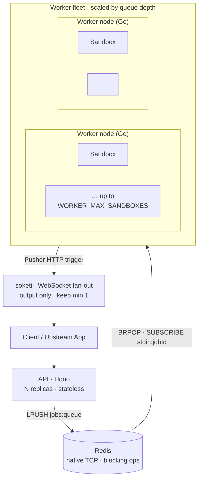

code-runner is designed to scale horizontally. Both the API and the worker are
**stateless** — all shared state lives in Redis — so you scale each tier by adding
replicas.

## The topology



## The scaling unit is the worker node

A worker is a **long-lived Go process** that claims jobs and launches sandboxes
*internally* — up to `WORKER_MAX_SANDBOXES` concurrently. The unit of scale is the
**node**, not a microVM per execution. This is what makes interactive sessions cheap:
holding a slot open for a live stdin session is just a goroutine, not a VM.

Capacity is governed by an in-memory semaphore inside each worker (authoritative), with
the Redis queue depth as the cross-fleet signal.

## Autoscale by queue depth

Scale the worker fleet on `LLEN jobs:queue`.

<Callout type="info">
  Autoscaling **relies on queueing being safe**: when a burst arrives faster than
  machines can boot, jobs wait in `jobs:queue` until a worker frees up. That works
  because the [start-handshake is durable](/docs/concepts/lifecycle#the-start-handshake)
  — a `start` sent while a job is still queued is persisted and honoured when a worker
  finally claims it, instead of being lost. Without that, every job that queued behind
  capacity would die at the warm-up timeout, which defeats the point of autoscaling.
</Callout>

**Fly.io** — use [`fly-autoscaler`](https://github.com/superfly/fly-autoscaler) with
the Redis LLEN metric:

```toml
[metrics.redis_queue_depth]
type   = "redis"
url    = "redis://your-redis-host:6379"
metric = "llen"
key    = "jobs:queue"

[scaling]
min   = 1
max   = 50
count = "min(50, max(1, qdepth / 2))"
```

**Kubernetes** — use [KEDA](https://keda.sh/) with the Redis scaler on
`LLEN jobs:queue`, or an HPA backed by a custom metric from a Redis exporter.

## Scale to zero

Because the API is stateless and the worker only holds in-flight jobs, the worker
fleet can scale to zero when the queue is empty. Jobs submitted while at zero sit in
`jobs:queue` until the autoscaler spins a worker up and it `BRPOP`s them. Keep at least
one API replica (or a scale-to-zero platform with fast cold start) so new jobs can be
enqueued.

soketi should **stay up** (min 1) — it's the live output transport and clients hold
persistent WebSocket connections to it.

## Self-contained worker images (fast, stateless autoscaling)

By default a worker caches language images in a `/var/lib/docker` **volume**. That
volume is what makes autoscaling awkward: volumes are per-machine, so an autoscaler
can't freely create and destroy nodes, and a fresh node pays a cold-start penalty
pulling images from a registry on first use.

For a **fixed language set** (the common case — you know which runtimes your platform
offers), bake the runner images **into the worker image** instead: `docker save` each
language image into the build and `docker load` them into the embedded dockerd on
boot. The payoff:

- **No volume** → workers are fully stateless → the autoscaler can create/destroy
  nodes freely (or start/stop a pool) with no per-machine storage to manage.
- **No registry pulls at runtime** → a new node is ready to run the instant its
  process is up; cold-start latency drops to image-load time (local, fast).

The tradeoff is a larger worker image (the sum of all language images) and a rebuild
when the language set changes — both fine for a stable platform. This is the
recommended topology when you want clean, fast autoscaling.

## Bursty & scheduled load (exams, batch windows)

Reactive autoscaling always lags: the queue has to build before the autoscaler reacts
(~15s loop) and machines take time to boot. For **predictable bursts** — an exam
starting, a nightly batch — don't wait for the queue. **Pre-warm**: raise the
autoscaler's `min` floor (or `fly scale count`) a few minutes *before* the window via
a scheduled job, then drop it after. Combine the two:

- **Scheduled floor** (calendar-driven) absorbs the burst with zero cold-start lag.
- **Reactive ceiling** (queue-depth-driven) is the safety net for unplanned spikes.

Two knobs to tune for bursts:

- **`MAX_QUEUE_DEPTH`** (API admission) — the API returns `429` once `jobs:queue`
  reaches this. Set it **generous** so a burst *queues and drains* instead of
  rejecting users mid-session; pair it with a per-user rate limit so one client can't
  flood. Too low and the autoscaler never sees enough depth to scale.
- **`idleMs` / `wallTimeMs`** — interactive sessions hold a slot for up to these
  windows. Longer idle = friendlier UX but each waiting session pins a slot, so you
  need more capacity for the same concurrency. Pick deliberately: generous for
  human-paced interactive work, short for fire-and-forget batch runs that should free
  their slot the instant they finish.

## Orphan recovery

If a worker dies mid-job, its sandboxes would be orphaned. A **reaper** loop detects
this: it lists containers labelled by job, checks which owning workers are still alive
(via heartbeat keys), and force-removes any container whose worker is gone — reclaiming
the volume and marking the job `error`. This keeps a crashed node from leaking
containers.

## Extra isolation with gVisor

For a stronger sandbox boundary in production, run sandboxes under
[gVisor](https://gvisor.dev/):

```bash
SANDBOX_RUNTIME=runsc
```

This sets `HostConfig.Runtime="runsc"` on every launch — **no worker code changes**.
gVisor's userspace kernel (the *Sentry*) intercepts all syscalls, giving
Firecracker-class isolation with no per-execution VM-create latency. The seccomp
profile stays in place as defense-in-depth. Validate each language image under runsc
first, since the Sentry governs syscall behaviour.

## Per-tier guidance

| Tier | Stateless? | Needs native Redis? | Scale by |
| --- | --- | --- | --- |
| API | yes | no (REST Redis OK) | replicas / serverless |
| Worker | yes | **yes** | queue depth (`LLEN jobs:queue`) |
| Redis | — | it *is* Redis | vertical / managed cluster |
| soketi | yes | no | connections; keep min 1 |

For a concrete walk-through on one platform, see the
[Fly.io reference deploy](/docs/self-hosting/deploy-fly).
