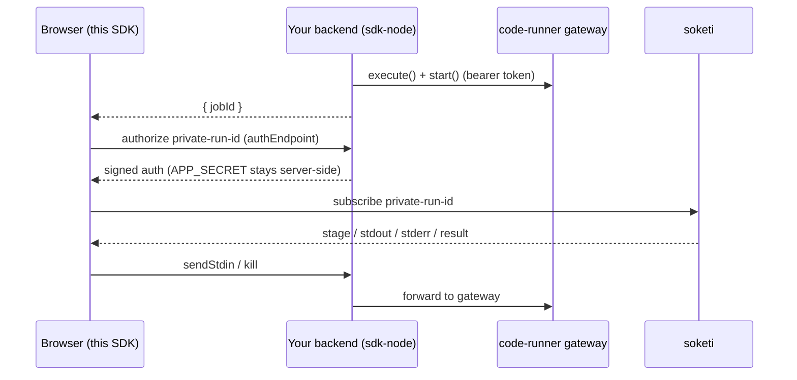

<p align="center">
  
</p>

<p align="center">
  <a href="https://www.npmjs.com/package/@teovilla/code-runner-react"></a>
  =18" />
  =8" />
  <a href="https://github.com/teovillanueva/code-runner/blob/main/LICENSE"></a>
</p>

# @teovilla/code-runner-react

The **browser** real-time SDK for the [code-runner](https://github.com/teovillanueva/code-runner) service.

- `<CodeRunnerProvider>` — one pusher-js client wired to your self-hosted soketi.
- `useCodeRunnerJob(...)` — subscribe to a job's `private-run-<jobId>` channel and get ordered `stdout` / `stderr`, the current `stage`, and the terminal `result`.

> **Output-only and token-free.** This package never holds the code-runner bearer token. It receives live output over soketi, and delegates actions (stdin / kill) to callbacks that hit *your* backend — which uses [`@teovilla/code-runner-sdk-node`](https://www.npmjs.com/package/@teovilla/code-runner-sdk-node).

## Install

```bash
npm i @teovilla/code-runner-react react pusher-js
```

`react` (>=18) and `pusher-js` (>=8) are peer dependencies you provide.

## Quickstart

### 1. Wrap your app

```tsx
import { CodeRunnerProvider } from "@teovilla/code-runner-react";

export function App({ children }: { children: React.ReactNode }) {
  return (
    <CodeRunnerProvider
      appKey={import.meta.env.VITE_SOKETI_APP_KEY}
      host="localhost"
      port={6001}
      useTLS={false}
      // your backend route that signs the private-channel auth with sdk-node's
      // createChannelAuthorizer (the soketi APP_SECRET lives only there)
      authEndpoint="/channel-auth"
    >
      {children}
    </CodeRunnerProvider>
  );
}
```

### 2. Subscribe to a job

```tsx
import { useCodeRunnerJob } from "@teovilla/code-runner-react";

function JobView({ jobId }: { jobId: string }) {
  const { stage, stdout, stderr, result, status, sendStdin, kill } =
    useCodeRunnerJob({
      jobId,
      // The browser has no token. These call back into YOUR backend, which
      // uses @teovilla/code-runner-sdk-node to talk to the gateway.
      onStdin: (chunk) =>
        fetch(`/api/jobs/${jobId}/stdin`, {
          method: "POST",
          headers: { "Content-Type": "application/json" },
          body: JSON.stringify({ chunk }),
        }),
      onKill: () => fetch(`/api/jobs/${jobId}/kill`, { method: "POST" }),
    });

  return (
    <div>
      <div>stage: {stage ?? "—"} · status: {status}</div>
      <pre>{stdout}</pre>
      <pre style={{ color: "crimson" }}>{stderr}</pre>
      <button onClick={() => sendStdin("hello\n")}>send stdin</button>
      <button onClick={() => kill()}>kill</button>
      {result && (
        <div>
          exit {String(result.exitCode)} · {result.durationMs}ms
          {result.timedOut && " · timed out"}
          {result.truncated && " · output truncated"}
        </div>
      )}
    </div>
  );
}
```

`stdout` / `stderr` are reassembled in `seq` order from the worker's chunks, so
they always render correctly even if soketi delivers out of order.

## The full circle



1. Your backend enqueues + starts a job with [`@teovilla/code-runner-sdk-node`](https://www.npmjs.com/package/@teovilla/code-runner-sdk-node) and returns `{ jobId }`.
2. The browser calls `useCodeRunnerJob({ jobId })`; pusher-js authorizes the
   `private-run-<jobId>` subscription against your `authEndpoint`, which signs
   with sdk-node's `createChannelAuthorizer`.
3. Live `stage` / `stdout` / `stderr` / `result` events stream in.
4. `sendStdin` / `kill` post to your backend, which forwards to the gateway via sdk-node.

The bearer token and soketi `APP_SECRET` never leave the server.

## License

MIT
