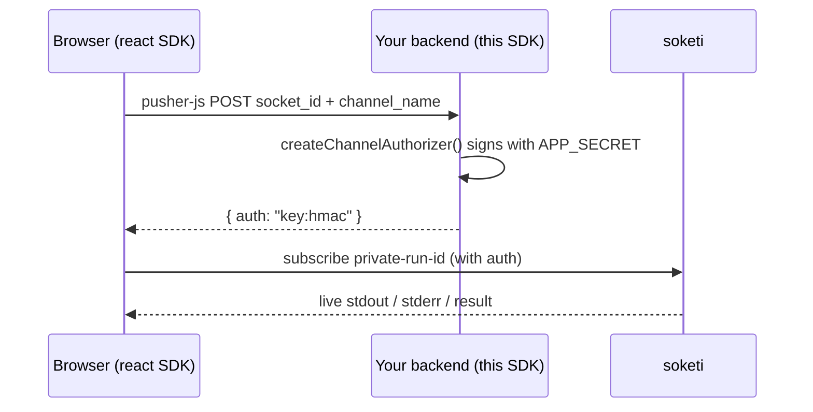

<p align="center">
  
</p>

<p align="center">
  <a href="https://www.npmjs.com/package/@teovilla/code-runner-sdk-node"></a>
  =22" />
  
  <a href="https://github.com/teovillanueva/code-runner/blob/main/LICENSE"></a>
</p>

# @teovilla/code-runner-sdk-node

The **server-side** SDK for the [code-runner](https://github.com/teovillanueva/code-runner) service.

- A typed `CodeRunnerClient` over the code-runner Hono gateway (bearer auth, typed errors).
- Zero-dependency soketi private-channel auth signing (`signChannelAuth` / `createChannelAuthorizer`) using only `node:crypto`.

> **Server-side only.** This package carries the `EXECUTOR_API_TOKEN` and signs with the soketi `APP_SECRET`. Never ship it — or those secrets — to a browser. The browser half is [`@teovilla/code-runner-react`](https://www.npmjs.com/package/@teovilla/code-runner-react).

## Install

```bash
npm i @teovilla/code-runner-sdk-node
```

Dual ESM + CJS with bundled type declarations. Requires Node >= 22.

## Client quickstart

```ts
import { CodeRunnerClient, CapacityError } from "@teovilla/code-runner-sdk-node";

const client = new CodeRunnerClient({
  baseUrl: "http://localhost:8080", // your code-runner gateway
  token: process.env.EXECUTOR_API_TOKEN!,
});

// 1. Enqueue a job
let job;
try {
  job = await client.execute({
    language: "python",
    files: [{ name: "main.py", content: "name = input(); print('hi', name)" }],
  });
} catch (err) {
  if (err instanceof CapacityError) {
    // no free sandbox slots — back off and retry
    console.log("retry after", err.retryAfterMs, "ms");
  }
  throw err;
}

console.log(job.jobId, job.channel, job.status); // "queued"

// 2. Start it (the client must have subscribed to job.channel first)
await client.start(job.jobId);

// 3. Drive the interactive session
await client.sendStdin(job.jobId, "world\n");
await client.closeStdin(job.jobId);
// await client.kill(job.jobId); // force-terminate if needed
```

### Methods

| Method | Endpoint |
| --- | --- |
| `listLanguages()` | `GET /v1/languages` |
| `execute(req)` | `POST /v1/execute` |
| `getJob(id)` | `GET /v1/jobs/:id` |
| `start(id)` | `POST /v1/jobs/:id/start` |
| `sendStdin(id, chunk)` | `POST /v1/jobs/:id/stdin` |
| `closeStdin(id)` | `POST /v1/jobs/:id/stdin/close` |
| `kill(id)` | `POST /v1/jobs/:id/kill` |

### Typed errors

Every non-2xx response is mapped to a typed error you can branch on with `instanceof`:

| Error | Status | Extra fields |
| --- | --- | --- |
| `UnauthorizedError` | 401 | — |
| `NotFoundError` | 404 | — |
| `ValidationError` | 400 | — |
| `CapacityError` | 429 (`execute`) | `retryAfterMs?` |
| `RateLimitError` | 429 (`stdin`) | `retryAfterMs?`, `capBytes?` |
| `CodeRunnerError` | other | `status?`, `body?` |

All extend `CodeRunnerError`.

## Channel auth (the full circle)



The browser subscribes to a private `private-run-<jobId>` soketi channel via
[`@teovilla/code-runner-react`](https://www.npmjs.com/package/@teovilla/code-runner-react).
pusher-js authorizes that subscription by POSTing to **your** backend, which
signs the response with the soketi `APP_SECRET`. This SDK gives you that signer
with zero dependencies:

```ts
import express from "express";
import { createChannelAuthorizer } from "@teovilla/code-runner-sdk-node";

const authorize = createChannelAuthorizer({
  appKey: process.env.SOKETI_APP_KEY!,
  appSecret: process.env.SOKETI_APP_SECRET!, // server-side only
});

const app = express();
app.use(express.json());

// pusher-js POSTs { socket_id, channel_name } here
app.post("/channel-auth", (req, res) => {
  const { socket_id, channel_name } = req.body;
  try {
    // throws unless channel_name is a private-run-* channel
    res.json(authorize(socket_id, channel_name));
  } catch {
    res.status(403).json({ error: "forbidden channel" });
  }
});
```

`createChannelAuthorizer` refuses any channel that is not `private-run-*`, so a
client can only ever authorize a code-runner job channel.

### Signing formula

`signChannelAuth` (and the authorizer it returns) produces exactly what the
Pusher/soketi protocol expects — byte-identical to the official `pusher` server SDK:

```
auth = `${appKey}:` + HMAC_SHA256(`${socketId}:${channelName}`, appSecret)  // hex
```

```ts
import { signChannelAuth } from "@teovilla/code-runner-sdk-node";

signChannelAuth({
  socketId: "123.456",
  channelName: "private-run-abc",
  appKey: "k",
  appSecret: "s",
});
// => { auth: "k:<hmac-sha256-hex>" }
```

## License

MIT
